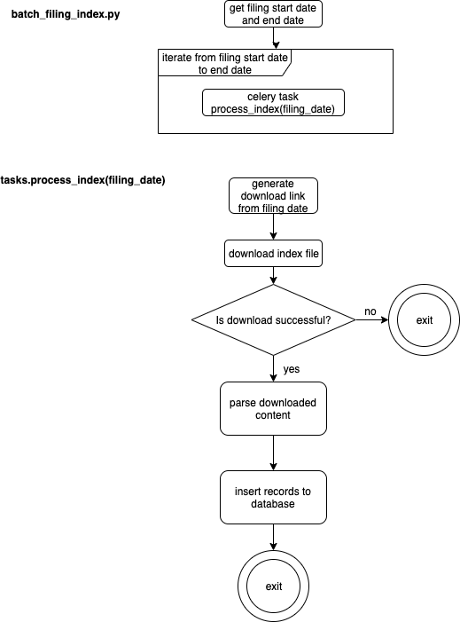
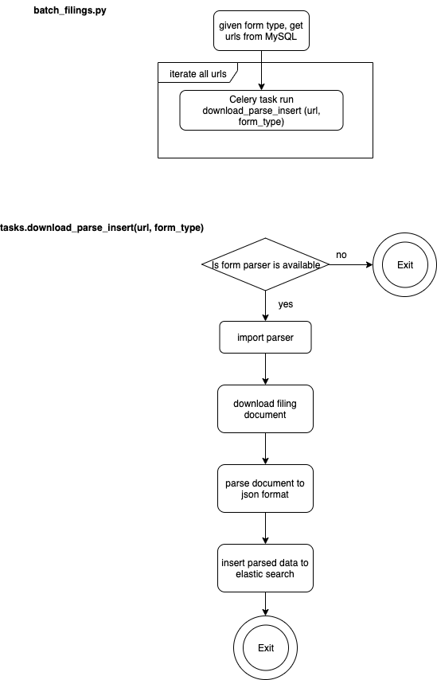
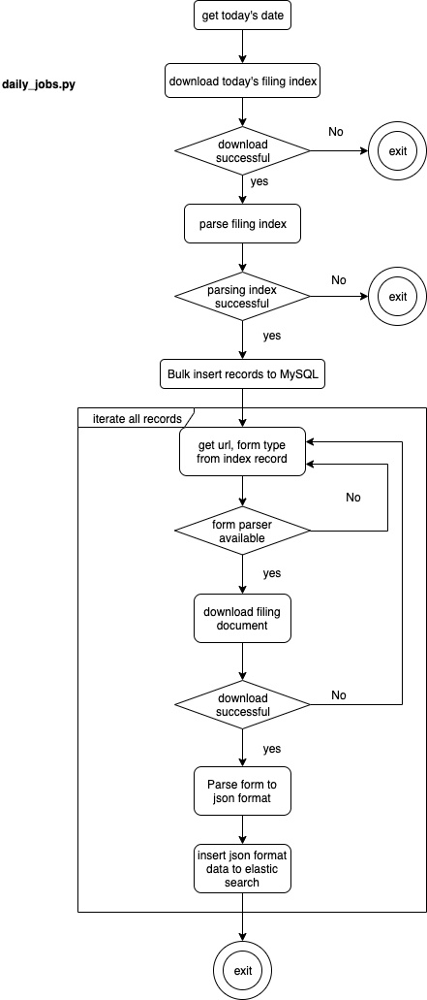

## User Guide

This module implements:
   * Batch processing for historical data
   * Daily running jobs

The `batch_filing_index.py` module contains the steps to perform batch processing of filing meta data. User must provide start and end date as parameters. Execute this script on the Celery executor machine.  
```
# e.g.: python batch_filing_index.py 2000-01-01 2019-10-12
python batch_filing_index.py <start_date> <end_date>
```

The `batch_filings.py` module currently only supports batch processing on 13F-HR filing documents. For project demo, only 13F-HR filings in 2019 are processed. Execute this script on the Celery executor machine. 

The `init_es.py` module initializes ElasticSearch index and mapping. 

The `daily_jobs.py` module runs daily jobs for retrieving and processing index file and filing documents, please run this script on Celery executor.  
```celery -A daily_jobs beat -f <logfile> --loglevel=info```

To start Celery workers, please run the following script on every Celery worker:   
```celery -A tasks worker -f <logfile> --loglevel=info```

## Development
To add a customized parser class, please create a class derived from class `AbstractFormParser`, name the file as `FormParser_<form-type>.py` and save it in the EdgarManagers/edgar_parsers folder. 

## Directory structure
├── EdgarManagers   
│   ├── __init__.py   
│   ├── batch_filing_index.py   
│   ├── batch_filings.py   
│   ├── config.py   
│   ├── daily_jobs.py   
│   ├── db   
│   │   ├── __init__.py   
│   │   ├── db_utils.py   
│   │   ├── filing_index_dao.py   
│   │   ├── history_dao.py   
│   │   └── tables.sql   
│   ├── edgar_parsers   
│   │   ├── FormParser.py   
│   │   ├── FormParser_13F_HR.py   
│   │   ├── __init__.py   
│   │   └── index_parser.py   
│   ├── elasticsearch_dao   
│   │   ├── __init__.py   
│   │   └── es_loader.py   
│   ├── init_es.py   
│   ├── requirements.txt   
│   ├── tasks.py   
│   └── utils   
│       ├── __init__.py   
│       ├── downloader.py   
│       └── funcs.py   
├── docker-compose.yml   
├── readme.md   
└── tests   
    ├── __init__.py


## Flow Charts
The workflow of batch processing filing index:   
   
The workflow of batch processing filing documents:   
  
The workflow of daily job:   
  
