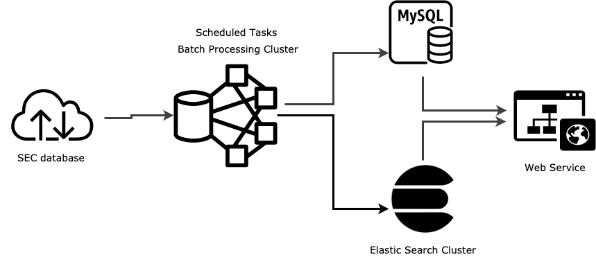

# SeeSEC
A simple, powerful SEC Query API

## Background
EDGAR database contains a wealth of information about the Commission and the securities industry which is freely available to the public. Information such as quarterly and yearly analysis of a public traded company, major share holders of a company, insider sells and buys etc, can be found in the filings of EDGAR database. It gives investors the ability to assess a company's history and progress, as well as make reasonable assumptions about its future through studying these filings. 

reference: [https://www.investopedia.com/articles/fundamental-analysis/08/sec-forms.asp](https://www.investopedia.com/articles/fundamental-analysis/08/sec-forms.asp)

## Features
* Filing Index API: retrieve filing meta information for company filing documents.  
Example: A simple call gets historical 10-Q form filing information by Apple between 2008-01-01 and 2010-01-01 in json format.  
[http://www.minimind.club/filing_index?cik=320193&form_type=10-Q&period1=20080101&period2=20100101](http://www.minimind.club/filing_index?cik=320193&form_type=10-Q&period1=20080101&period2=20100101)

* Filings API: to query the content of filing documents, this call gets the 13F-HR forms that filed between 2019-07-01 and 2019-09-01 and contains MongoDB in its holdings in json format.  
This API currently only supports 13H-HR from 2019-01-01 to 2019-10-01 form content query, and can be extended to other types of forms in the future.   
[http://www.minimind.club/13f_search?cusip=60937P106&period1=20190701&period2=20190901](http://www.minimind.club/13f_search?cusip=60937P106&period1=20190701&period2=20190901)

* This API also provides user friendly web interface
[http://www.minimind.club](http://www.minimind.club)

## Pipeline

## Technical challenges
1. System scalability
   * Use Python Celery to set up distributed computing cluster for high work load. Computing capability can be scaled up horizontally by add more Celery workers.
1. Extensibility  
   * EdgarMangers module allow users to add customized parsers to process filing documents. (For implementation details, please check readme in EdgarManagers module)
1. High data accuracy (future plan)  
   * Add retries for transient failures in MySQL   
   * Add NoSQL database as source of truth for ElasticSearch

